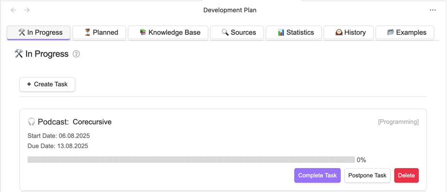

# Personal Development Plan



A comprehensive productivity Obsidian-plugin that helps you organize and track personal/professional development tasks.

## Key Features

- **7-Tab Interface** for task management:
    - 🛠️ In Progress - Active tasks
    - ⏳ Planned - Queue for execution
    - 📚 Knowledge Base - Tasks without detailed plan
    - 🔍 Sources - Sources for replenishing the knowledge base
    - 📊 Statistics - Progress analytics
    - 🕰️ History - Completed tasks
    - 📂 Examples - Ready-made development plan templates

- **Task Lifecycle Management**:
  ```
  Knowledge Base → Planned → In Progress → History
  ```

- **Notifications**:
    - Task limit warnings
    - Deadline alerts

- **Periodic Tasks**:
    - Daily/Weekly/Monthly/Quarterly/Yearly templates
    - Automatic task generation

## Installation

1. Open Obsidian → Preferences → Community plugins → Community plugins
2. Click "Browse" and search "Personal Development Plan"
3. Install and enable the plugin

## Documentation

- [Home page](https://artemkorsakov.github.io/personal-development-plan/)
- [Task Lifecycle](https://artemkorsakov.github.io/personal-development-plan/lifecycle.html)
- [Statistics System](https://artemkorsakov.github.io/personal-development-plan/stats.html)
- [Periodic Tasks](https://artemkorsakov.github.io/personal-development-plan/periodic.html)
- [Configuration Guide](https://artemkorsakov.github.io/personal-development-plan/settings.html)

## Other languages

- [На русском](README_ru.md)

## Support

[Create an issue to fix a bug or add functionality](https://github.com/artemkorsakov/personal-development-plan/issues)

## License

This plugin is distributed under the MIT License. You are free to use, modify, and distribute it.
