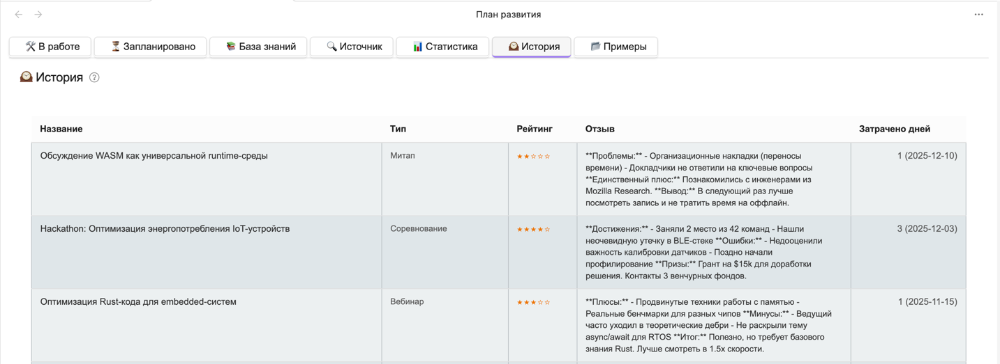

# История выполнения задач

## Формат записи истории

После завершения задачи она сохраняется в истории.

Структура архивированных задач следующая:

- **Тип**
- **Название**
- **Дата начала**
- **Дата завершения**
- **Затрачено дней**
- **Оценка**:
	- ★ - Плохо (не соответствует ожиданиям)
	- ★★ - Удовлетворительно (минимально полезно)
	- ★★★ - Хорошо (стандартное качество)
	- ★★★★ - Очень хорошо (выше среднего)
	- ★★★★★ - Отлично (превзошло ожидания)
- **Краткое ревью**:
	- Основные выводы
	- Полезные идеи
	- Критика и замечания
	- Рекомендации (Да/Нет) с обоснованием

## Задача

История выполнения задач необходима для расчета статистики и построения прогноза выполнения будущих задач.
