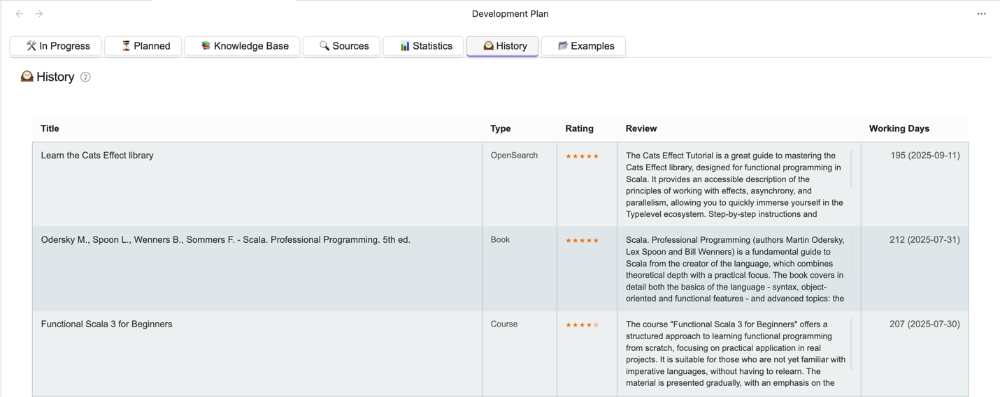

# Task Execution History

## History Record Format

After completion, the task is saved in history.

The structure of archived tasks is as follows:

- **Title**
- **Type**
- **Rating**:
    - ★ - Poor (does not meet expectations)
    - ★★ - Fair (minimally useful)
    - ★★★ - Good (standard quality)
    - ★★★★ - Very good (above average)
    - ★★★★★ - Excellent (exceeded expectations)
- **Brief review**:
    - Key findings
    - Useful ideas
    - Criticism and comments
    - Recommendations (Yes/No) with justification
- **Days spent**
    - The number of days from the start date to the end date inclusive is counted

## Purpose

The task execution history is necessary for calculating statistics and building a forecast for the execution of future tasks.
