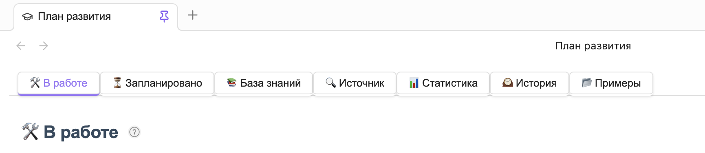
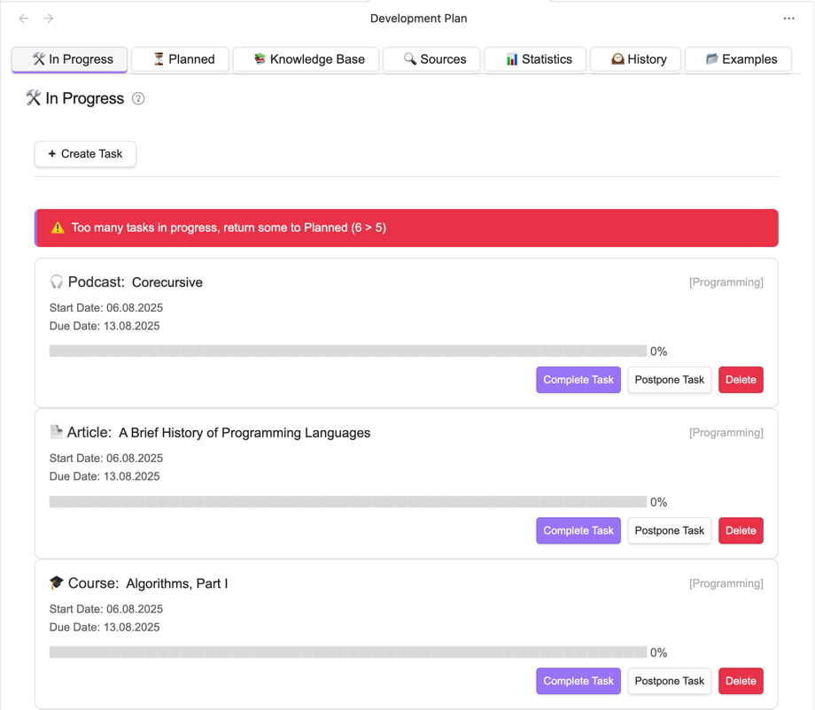
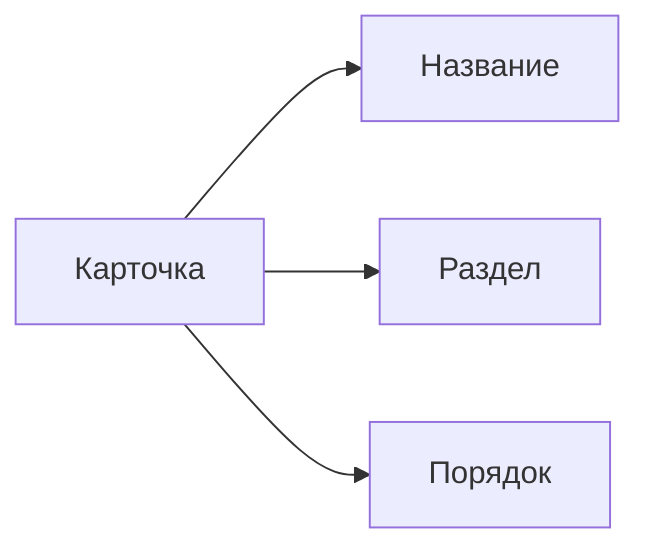
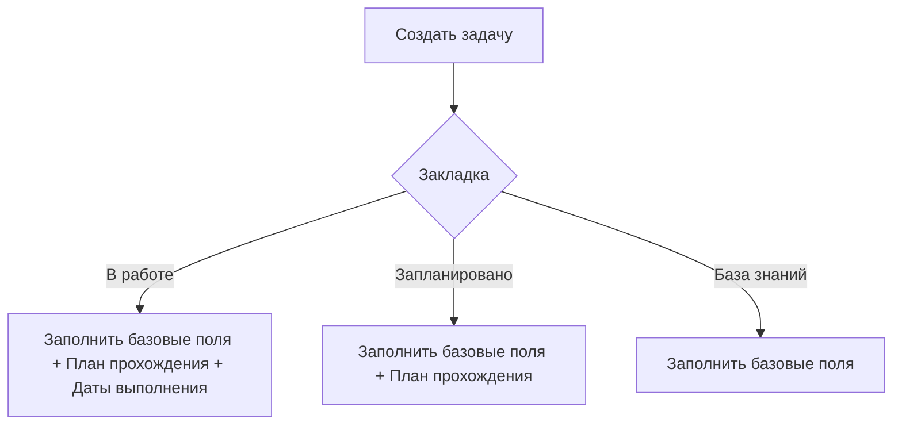

# Personal Development Plan

**"Personal Development Plan"** — это плагин для Obsidian,
предназначенный для структурированного планирования личного и профессионального развития.
Он помогает организовать задачи по обучению, отслеживать прогресс и управлять ресурсами.

---

# Обзор плагина

**Основные закладки:**

- 🛠️ **В работе** - Текущие задачи в работе                                                      
- ⏳ **Запланировано** - Запланированные, но ещё не начатые задачи                                    
- 📚 **База знаний** - Материалы для изучения, по которым пока не сформирован детализированный план 
- 🔍 **Источник** - Ресурсы для пополнения Базы знаний
- 📊 **Статистика** - Анализ прогресса по всем разделам 
- 🕰️ **История** - Архив выполненных задач          
- 📂 **Примеры** - Шаблоны планов от сообщества      



---

# Подробное описание разделов

## **Закладка "В работе"**

Отображает все текущие активные задачи, над которыми ведётся работа в данный момент.



### **Основные функции**

1. **Сортировка задач**
    - Задачи автоматически сортируются по порядковому номеру (полю `order`)
    - Нумерация начинается с 1 (наивысший приоритет)
    - Порядковый номер отображается в правом верхнем углу карточки

2. **Навигация к задаче**
    - Клик по любой области карточки открывает связанный Markdown-файл задачи (расположены в папке PersonalDevelopmentPlan)
    - Файл открывается в стандартном режиме редактирования Obsidian

3. **Визуализация прогресса**
    - Каждая задача содержит индикатор выполнения в виде:
        - Графического прогресс-бара (символьная шкала)
        - Точного процентного значения (например "45%")
    - Прогресс обновляется автоматически при изменении исходного файла

4. **Система предупреждений**
    - При превышении лимита активных задач (задается в [настройках](settings.md)) появляется предупреждение:
      ```
      ⚠️ Слишком много задач в работе, верните часть из них в Очередь (5 > 3)
      ```
    - Предупреждение исчезает при приведении количества задач в соответствие с настройками

5. **Контроль сроков**
    - Просроченные задачи автоматически помечаются:
        - Красным цветом даты завершения
        - Текстом "Просрочено" рядом с датой
        - Восклицательным знаком в иконке типа задачи

### **Структура карточки задачи**

Каждая карточка содержит:

1. **Заголовок**:
    - Иконка типа задачи (книга, курс, статья и т.д. - задается в [настройках](settings.md))
    - Название задачи (как в связанном файле)
    - Раздел/категория в квадратных скобках (разделы задаются в [настройках](settings.md))

2. **Даты**:
    - Дата начала работы (фиксируется при добавлении в "В работе")
    - Планируемая дата завершения (запрашивается при добавлении в "В работе")

3. **Индикатор выполнения**:
    - Графическое представление (например: 🟩🟩⬜⬜⬜)
    - Числовое значение (например: 40%)

4. **Метка порядка**:
    - Отображается как `#N` в правом верхнем углу
    - Соответствует полю `order` в YAML-заголовке

### **Пример YAML-заголовка для задачи**

Описывается ниже в блоке "Типы задач".

### **Рекомендации по использованию**

1. Для изменения порядка задач редактируйте поле `order`
2. Для срочных задач устанавливайте более высокий приоритет (меньший номер в `order`)

---

## **Закладка "Запланировано"**

Запланированные задачи, которые можно взять в работу.

### Подзакладки:

- 📚 Книга (кол-во)
- 📄 Статья (кол-во)
- 🎓 Курс (кол-во)
- ▶️ Видео (кол-во)
- 🎧 Подкаст (кол-во)
- ✏️ Пользовательский тип (кол-во)

### Карточка задачи:



**Функционал:**

- Задачи отсортированы по порядку, задаваемому в карточке.
- Клик → открытие связанного `.md`-файла.

---

## **Закладка "База знаний"**

Материалы для изучения (без детализированного плана).

### Подзакладки (Типы):

- 📚 Книга (кол-во)
- 📄 Статья (кол-во)
- 🎓 Курс (кол-во)
- ▶️ Видео (кол-во)
- 🎧 Подкаст (кол-во)
- ✏️ Пользовательский тип (кол-во)

### Подзакладки (Разделы):

- Алгоритмы (кол-во)
- Функциональное программирование (кол-во)
- Scala (кол-во)
- Теория категорий (кол-во)
- Программирование (кол-во)
- ...

### Таблица задач:

| Название              | Раздел           |
| --------------------- | ---------------- |
| "Martin - Clean Code" | Программирование |
| ...                   | ...              |

**Функционал:**

- Задачи отсортированы по названию.
- Клик по названию → открытие `.md`-файла.
- Кнопка в верхнем меню **"Экспорт в JSON"** → можно поделиться с сообществом.

---

## **Закладка "Источник"**

Ресурсы для поиска новых материалов.

### Карточки:

- 📚 Книга
- 📄 Статья
- 🎓 Курс
- ▶️ Видео
- 🎧 Подкаст
- ✏️ Пользовательский тип

**Функционал:**

- Клик → создание нового `.md`-файла для добавления в "Библиотеку".

---

# Жизненный цикл задач

## Полный жизненный цикл задачи


## Детализация кнопок управления

### Кнопка "Создать задачу"

**Доступна в:** "В работе", "Запланировано", "База знаний".



#### Для раздела "База знаний":

| Поле      | Обязательное     | Тип             | Пример                                             | Описание                       |
| --------- | ---------------- | --------------- | -------------------------------------------------- | ------------------------------ |
| Тип       | Да               | Выбор из списка | Книга                                              | Книга/Статья/Курс/...          |
| Автор(-ы) | Только для Книги | Строка          | Одерски М., Спун Л., Веннерс Б., Соммерс Ф.        |                                |
| Название  | Да               | Строка          | Scala. Профессиональное программирование. 5-е изд. |                                |
| Раздел    | Да               | Выбор из списка | Scala                                              | Scala/ФП/Теория категорий/...  |
| Страниц   | Только для Книги | Число           | 608                                                |                                |
| Порядок   | Да               | Число           | 1                                                  | Порядок взятия задачи в работу |

#### Для раздела "Запланировано":

Дополнительно:

- План прохождения (текстовое поле с markdown-разметкой)
  Пример:
	- [ ] Глава 1
	- [ ] Глава 2
	- [ ] Глава 3
	- [ ] ...

#### Для раздела "В работе":

Дополнительно:

- Дата взятия в работу (авто-заполнение поля текущей датой)
- Планируемая дата выполнения

### 2. Кнопка "Поставить в очередь"

**Действие:** Переводит задачу из "База знаний" в "Запланировано"


### 3. Кнопка "Взять в работу"

**Действие:** Переводит задачу из "Запланировано" во "В работе"


### 4. Кнопка "Отложить"

**Доступна только в:** "В работе"

**Действие:** Возвращает задачу из "В работе" в "Запланировано"


### 5. Кнопка "Выполнить"

**Доступна только в:** "В работе"


**Поля для заполнения:**

1. Краткое ревью
2. Оценка (1-5 звёзд)
3. Дата выполнения (авто-заполнение)

### 5. Кнопка "Удаление"

**Важно:** Безвозвратное удаление!

**Процесс удаления:**

1. Показ модального окна с предупреждением
2. Требование подтверждения через ввод слова "УДАЛИТЬ"
3. Полное удаление всех связанных данных

---

# Типы задач

## Общие поля для всех типов задач

- **Тип** - Категория контента (книга, статья, видео, подкаст и т.д.)
- **Название** - Основное название материала
- **Статус** - Статус выполнения (В работе/Запланировано/База знаний)
- **Раздел** - Тематическая категория (например: Программирование, Теория Категорий)
- **Порядок** - Приоритет в очереди (цифра, где 1 - высший приоритет)
- **Дата взятия в работу** - Дата начала работы с материалом (формат: ГГГГ-ММ-ДД)
- **Дата выполнения** - Планируемая дата завершения (формат: ГГГГ-ММ-ДД)

### Прогресс

Прогресс считается по проценту выполненных пунктов в задаче

## Книга

### Дополнительные поля

- **Автор(-ы)** - ФИО автора или список авторов
- **Название** - Название книги
- **Страниц** - Общее количество страниц

### Тело задачи

```markdown
## Описание

Краткое описание содержания и цели чтения

## Прогресс выполнения

- [x] Прочитать главы 1-3 (2023-10-01)
- [ ] Прочитать главы 4-6
- [ ] Сделать конспект
- [ ] Сохранить книгу в Облаке (дополнительный пункт для всех задач типа Книга, задаваемый в настройках)
- [ ] Посоветовать друзьям (дополнительный пункт для всех задач типа Книга, задаваемый в настройках)
```

## Статья

### Дополнительные поля

- **Источник**: Ссылка на публикацию
- **Трудозатратность**: в часах

### Тело задачи

```markdown
## Аннотация

[Краткое содержание]

## Прогресс выполнения

- [x] Первичное прочтение (2023-10-01)
- [ ] Выделить ключевые тезисы
- [ ] Добавить в базу знаний (дополнительный пункт для всех задач типа Статья, задаваемый в настройках)
```

## Видео

### Дополнительные поля

- **Автор/Канал**: Создатель контента
- **Платформа**: YouTube/Coursera и т.д.
- **Ссылка**: URL видео
- **Продолжительность**: Длительность в минутах

### Тело задачи

```markdown
## Описание

[О чем видео, зачем смотреть]

## Конспект

- Таймкоды ключевых моментов
- Основные идеи

## Прогресс выполнения

- [x] Первый просмотр (2023-10-01)
- [ ] Анализ контента
- [ ] Выписать цитаты
- [ ] Добавить в базу знаний (дополнительный пункт для всех задач типа Видео, задаваемый в настройках)
```

## Подкаст

### Дополнительные поля

- **Автор/Подкаст**: Название шоу или автора
- **Платформа**: Spotify, Apple Podcasts и т.д.
- **Продолжительность**: Длительность в минутах

### Тело задачи

```markdown
## Основные темы

[О чем этот подкаст]

## Полезная информация

- Ключевые моменты
- Ссылки на упомянутые ресурсы

## Прогресс выполнения

- [x] Прослушан первый час (2023-10-01)
- [ ] Конспектирование
- [ ] Добавить заметки в базу знаний (дополнительный пункт для всех задач типа Подкаст, задаваемый в настройках)
```

## Курс

### Дополнительные поля

- **Платформа**: Coursera/Stepik и т.д.
- **Продолжительность**: Длительность в минутах

### Тело задачи

```markdown
## Описание курса

[Чему посвящен курс, цели изучения]

## Программа

- Список модулей с прогрессом
- Важные задания

## Прогресс выполнения

- [x] Завершен модуль 1 (2023-10-01)
- [ ] Выполнить практическое задание 2
- [ ] Пройти тест по модулю 3
- [ ] Добавить заметки в базу знаний (дополнительный пункт для всех задач типа Курс, задаваемый в настройках)
```

## Произвольный тип (UserType)

### Дополнительные поля

- **Трудозатратность**: в часах

### Тело задачи

```markdown
## Детали

[Полное описание задачи]

## Требования

- Необходимые подготовительные действия
- Дополнительные материалы

## Прогресс выполнения

- [x] Этап 1 (2023-10-01)
- [ ] Этап 2
- [ ] Финальная проверка
- [ ] Дополнительные задачи из настроек (дополнительный пункт для всех задач типа UserType, задаваемый в настройках)
```

# Система статистики и прогнозирования

## Общая статистика

### Основные метрики

- **Всего задач в плане**:
	- Общее количество всех запланированных материалов
	- Подразделы:
		- В работе
		- Запланировано
		- База знаний

## Детальная аналитика

### По типам контента

- **Книги**:
	- Всего в плане (В работе + Запланировано + База знаний): X
	- Прочитано (История): Y
	- Страниц осталось: Z
- **Статьи**:
	- Всего в плане (В работе + Запланировано + База знаний): X
	- Прочитано (История): Y
	- Часов осталось: Z
- **Видео**:
	- Всего в плане (В работе + Запланировано + База знаний): X
	- Просмотрено (История): Y
	- Часов осталось: Z
- **Подкаст**:
	- Всего в плане (В работе + Запланировано + База знаний): X
	- Прослушано (История): Y
	- Часов осталось: Z
- **Курсы**:
	- Всего в плане (В работе + Запланировано + База знаний): X
	- Завершено (История): Y
	- Часов осталось: Z
- **Пользовательский типа**:
	- Всего в плане (В работе + Запланировано + База знаний): X
	- Завершено (История): Y
	- Часов осталось: Z

### По разделам

- Распределение задач по тематикам:
	- Функциональное программирование: X (Y%)
	- Scala: N (M%)
	- Личное развитие: K (L%)
	- Другие категории

## Система прогнозирования

### Методология расчета

**Базовые параметры:**

- Дата начала отсчета из настроек плагина: [YYYY-MM-DD]

**Алгоритмы прогноза:**

Для **книг**:

> Прогноз в днях = Общее кол-во оставшихся страниц / Средняя скорость (прочитано страниц/пройдено дней с начала отсчета)

Для остальных типов:

> Прогноз в днях = Суммарная оставшаяся продолжительность / Средняя скорость (завершено в часах/пройдено дней с начала отсчета)

### Визуализация прогноза

- График освоения по типам контента
- Диаграмма Ганта с прогнозируемыми сроками
- Индикаторы:
	- Оптимистичный прогноз (+15%)
	- Базовый прогноз
	- Пессимистичный прогноз (-15%)

## Пример вывода статистики

### Текущая статистика

| Метрика                               | Книги         | Статьи   | Видео     | Подкаст | Полз.тип | Всего |
| ------------------------------------- | ------------- | -------- | --------- | ------- | -------- | ----- |
| Всего в плане (без учета завершенных) | 24            | 56       | 18        | 13      | 117      | 98    |
| Завершено                             | 8             | 32       | 6         | 4       | 111      | 46    |
| Осталось                              | 12000 страниц | 75 часов | 146 часов | 201 час | 2 часа   |       |

### Прогноз завершения

- Книги: 318.5 дней
- Статьи: 23 дня
- Видео: 242 дня
- Подкаст: 47 дней
- Пользовательский тип: 1 день

# История выполнения задач

## Формат записи истории

Для каждого выполненного элемента сохраняется следующая информация:

- **Тип**: Книга/Статья/Видео/Подкаст/Курс/Пользовательский
- **Полное наименование**: Название с указанием автора/источника
- **Дата начала**: YYYY-MM-DD
- **Дата завершения**: YYYY-MM-DD
- **Общее время работы**: X дней/часов
- **Оценка**:
	- ★ - Плохо (не соответствует ожиданиям)
	- ★★ - Удовлетворительно (минимально полезно)
	- ★★★ - Хорошо (стандартное качество)
	- ★★★★ - Очень хорошо (выше среднего)
	- ★★★★★ - Отлично (превзошло ожидания)
- **Краткое ревью**:
	- Основные выводы
	- Полезные идеи
	- Критика и замечания
	- Рекомендации (Да/Нет) с обоснованием

## Пример заполненной записи

## История выполнения задач

| Тип        | Полное наименование                         | Дата начала | Дата завершения | Время работы | Оценка | Краткое ревью                                                                                                                                              |
| ---------- | ------------------------------------------- | ----------- | --------------- | ------------ | ------ | ---------------------------------------------------------------------------------------------------------------------------------------------------------- |
| **Книга**  | "Чистый код" - Роберт Мартин                | 2023-05-15  | 2023-06-20      | 36 дней      | ★★★★   | **Плюсы:** Отличные практические примеры. Четкая структура.<br>**Минусы:** Некоторые примеры устарели.<br>**Рекомендация:** Да, разработчикам всех уровней |
| **Курс**   | "Основы Python" - Stepik (24 урока)         | 2023-06-05  | 2023-07-10      | 35 дней      | ★★★    | **Плюсы:** Хорошо структурирован. Практические задания.<br>**Минусы:** Базовый уровень, мало продвинутых тем.<br>**Рекомендация:** Да, для начинающих      |
| **Статья** | "10 принципов SOLID" - Medium (Иван Петров) | 2023-08-15  | 2023-08-16      | 2 часа       | ★★★★   | **Плюсы:** Конкретные примеры. Хорошие аналогии.<br>**Минусы:** Мало примеров на Python.<br>**Рекомендация:** Да, для изучения принципов ООП               |

# Система периодических задач

## Механизм работы

**Активация задач**:

- Ежедневно в 00:05 система проверяет периодичность задач
- Если текущая дата попадает в заданный период → задачи добавляются в специальную карточку для периодических задач на закладке "В работе"

**Структура карточки**:

```markdown
## 📅 Актуальные периодические задачи (2023-11-15)

### 🔄 Еженедельные (12-18 ноября)

- [ ] Открыть сайт [Feedly.com](https://feedly.com/i/my/me)
  - [ ] Новые записи в подкастах перенести в раздел Подкасты
  - [ ] Добавить в Базу знаний новые статьи
- [ ] Прочитать одну главу из текущей книги
- [ ] Решить задачу на Project Euler

### 📆 Ежемесячные (ноябрь)

- [ ] Пройтись по Базе знаний
  - [ ] Удалить потерявшие актуальность задачи!
  - [ ] Обновить порядок при необходимости

➕ Добавить разовую задачу [Текст задачи] [Добавить]
```

## Типы периодичностей

### Ежедневные

**Примеры**:

```markdown
- [ ] Утренний обзор почты (08:00)
- [ ] Физическая активность 30 мин
- [ ] Прочитать главу из книги
```

### Еженедельные

**Примеры**:

```markdown
- [ ] Решить задачу на Project Euler
- [ ] Прослушать подкаст "Culips"
- [ ] Посмотреть видео с доклада ScalaConf
```

### Ежемесячные

**Примеры**:

```markdown
- [ ] Удалить из плана потерявшие актуальность задачи
- [ ] Актуализировать порядок задач
```

### Ежеквартальные

**Примеры**:

```markdown
- [ ] Добавить в Базу знаний книги, рекомендованные на ScalaConf
- [ ] Закончить курс "Продвинутая Scala"
```

### Ежегодные

**Примеры**:

```markdown
- [ ] Выгрузить базу знаний Плана и поделиться ей с сообществом
```

## Примеры сценариев

### Сценарий 1: Активация еженедельной задачи

1. Пользователь настроил еженедельную задачу "Анализ метрик"
2. В среду 15 ноября система создает инстанс задачи
3. В карточке "Актуально" появляется:

```markdown
### 🔄 Еженедельные (13-19 ноября)

- [ ] Анализ метрик
```

### Сценарий 2: Добавление разовой задачи

1. Пользователь нажимает "Добавить задачу"
2. Вводит: "Подготовить презентацию к митингу"
3. Система создает:

```markdown
### Текущие задачи

- [ ] Подготовить презентацию к митингу
```

# Установка

1. **Установите плагин**:
	- Откройте Obsidian.
	- Перейдите **Settings** → **Community plugins**.
	- Кникните **Browse** и найдите "Personal Development Plan".
	- Установите и включите плагин.

2. [**Настройте ваш Personal Development Plan**](settings.md).

---

# Детальная информация

- [Настройки](settings.md)
- [Примеры планов](examples.md)

---

# Заключение

Плагин **Personal Development Plan** помогает систематизировать обучение, избегать перегрузки и отслеживать прогресс.

---

# Поддержка

Создайте задачи на [GitHub repository][github].

[github]: https://github.com/artemkorsakov/personal-development-plan/issues
