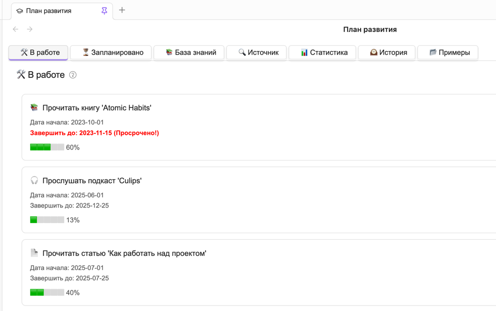
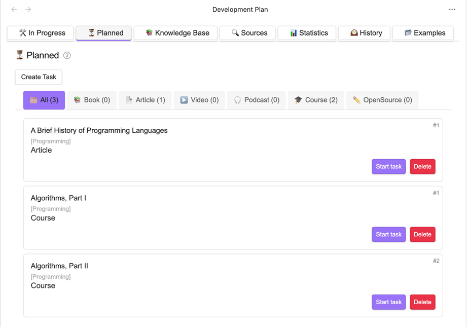
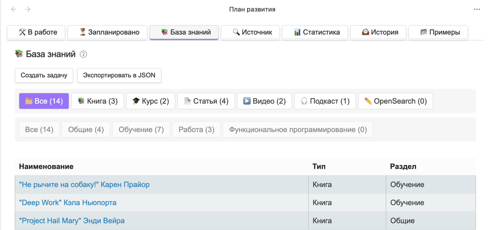
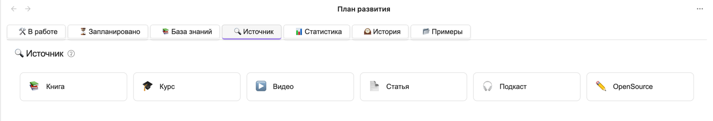
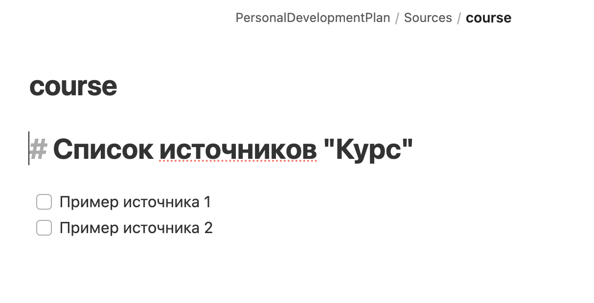

# Personal Development Plan

**Personal Development Plan** — это [Obsidian](https://obsidian.md/) плагин для системы управления знаниями,
предназначенный для планирования и отслеживания личного и профессионального развития.



Плагин имеет 7 основных вкладок, расположенных в верхней части интерфейса:

1. **🛠️ В работе** - Активные задачи в процессе выполнения
2. **⏳ Запланировано** - Материалы, запланированные к изучению
3. **📚 База знаний** - Не детализированные учебные материалы
4. **🔍 Источник** - Внешние ресурсы для пополнения базы знаний
5. **📊 Статистика** - Анализ прогресса развития
6. **🕰️ История** - Архив завершенных задач
7. **📂 Примеры** - Готовые шаблоны Баз знаний от сообщества

---

## Вкладка "🛠️ В работе"

Отображает все активные задачи, 
над которыми пользователь работает в текущий момент.


Каждая задача представлена в виде карточки со следующей структурой:

```
📚 Чистый код                              [Программирование]   #3
▲
|  Дата начала: 2023-10-01
|  Завершить до: 2023-12-15 (Просрочено!)
|
|  Прогресс: ██████████░░░░░░ 62%
▼
```

Где:

- `#3` - Порядковый номер (приоритет)
- `📚` - Тип материала (иконка)
- `Чистый код` - Название задачи
- `[Программирование]` - Раздел
- `Дата начала` - дата взятия задачи в работу
- `Завершить до` - планируемая дата завершения
- `Прогресс` - процент выполненных подпунктов

**Клик по карточке** открывает Markdown-файл задачи.

#### Система уведомлений

- **Превышение лимита задач**:
  Если количество задач "В работе" превышает заданный в настройках лимит, то выдается предупреждение
  `⚠️ Слишком много задач в работе, верните часть из них в Очередь (5/3)`.
  Предупреждение позволяет контролировать количество одновременно выполняемых задач
  и не допускать перегруза в плане обучения.
- **Просроченные задачи**:
  Если задача вышла за рамки запланированного периода, то выдается предупреждение `Завершить до: 2023-12-15 (Просрочено!)`.
  Сообщение обращает внимание на задачи, которые, возможно, стоит дополнительно разбить на подзадачи и 
  распланировать более детально.

---

### Вкладка "⏳ Запланировано"

Хранилище для задач, которые поставлены в Очередь на выполнение.



Материалы группируются по типам (в скобках количество задач заданного типа):

- 🗂️ Все (51)
- 📚 Книга (12)
- 🎓 Курс (5)
- 📄 Статья (23)
- ▶️ Видео (7)
- 🎧️ Подкаст (3)
- ✏️ Пользовательский тип (1)

Задачи сортируются по полю `order`, задаваемому при [создании задачи](lifecycle.md).

---

### Вкладка "📚 База знаний"

Список задач, по которым пока ещэ не сформирован детализированный план выполнения.



Задачи из "Базы знаний" отличаются от задач в "Запланировано" тем, что у запланированных задач уже есть
детализированный план выполнения и их можно сразу брать в работу.
Задачи же из "Базы знаний" пока ещё не распланированы, поэтому брать их в работу преждевременно.

---

## **Закладка "Источник"**

Интерактивная панель для быстрого доступа к ресурсам различных типов. 
Каждый тип материала представлен карточкой с иконкой и названием.



### Типы материалов

Система поддерживает карточки ресурсов для всех типов из [настроек](settings.md):

| Иконка | Тип материала          | Описание                         |
|--------|------------------------|----------------------------------|
| 📚     | Книги                  | Литература по теме               |
| 📄     | Статьи                 | Научные и технические публикации |
| 🎓     | Курсы                  | Обучающие программы и материалы  |
| ▶️     | Видео                  | Обучающие ролики и лекции        |
| 🎧     | Подкасты               | Аудиоматериалы и интервью        |
| ✏️     | Пользовательский тип 1 | Настраиваемый тип (из настроек)  |
| ✏️     | Пользовательский тип 2 | Настраиваемый тип (из настроек)  |

При клике на карточку открывается файл ресурсов заданного типа.

### Пример содержимого файла



### Настройки

В конфигурации плагина можно:

1. Включить/отключить типы материалов
2. Изменить порядок отображения

---

# Более подробная информация

- [Жизненный цикл задач](lifecycle.md)
- [Система статистики и прогнозирования](stats.md)
- [История выполнения задач](history.md)
- [Система периодических задач](periodic.md)
- [Настройки](settings.md)
- [Экспорт Базы знаний и Примеры базы знаний](examples.md)

---

# Установка

1. **Установите плагин**:
	- Откройте Obsidian.
	- Перейдите **Settings** → **Community plugins**.
	- Кникните **Browse** и найдите "Personal Development Plan".
	- Установите и включите плагин.

2. [**Настройте ваш Personal Development Plan**](settings.md).

---

# Заключение

Плагин **Personal Development Plan** помогает систематизировать обучение, избегать перегрузки и отслеживать прогресс.

---

# Поддержка

## Как получить помощь

Мы рады любой помощи и обратной связи!

1. **Сообщения об ошибках и новые фичи**  
   Если вы нашли баг или хотите предложить новую функцию, создайте issue в [GitHub репозитории][github-issues].

2. **Вопросы и обсуждения**  
   Для общих вопросов и обсуждений используйте [GitHub Discussions][github-discussions].

[github-issues]: https://github.com/artemkorsakov/personal-development-plan/issues
[github-discussions]: https://github.com/artemkorsakov/personal-development-plan/discussions
