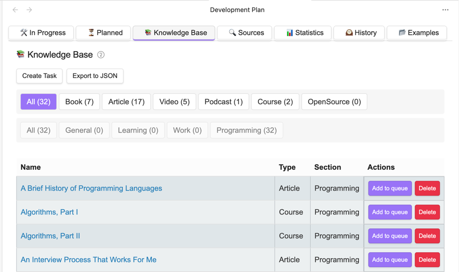

# Personal Development Plan

- [На русском](https://artemkorsakov.github.io/personal-development-plan/ru/)

**Personal Development Plan** is an [Obsidian](https://obsidian.md/) knowledge management system plugin,
designed for planning and tracking personal and professional development.


The plugin has 7 main tabs located at the top of the interface:

1. **🛠️ In Progress** - Active tasks in progress
2. **⏳ Planned** - Materials planned for study
3. **📚 Knowledge Base** - Non-detailed training materials
4. **🔍 Source** - External resources for replenishing the knowledge base
5. **📊 Statistics** - Analysis of development progress
6. **🕰️ History** - Archive of completed tasks
7. **📂 Examples** - Ready-made Knowledge Base templates

---

## "🛠️ In Progress" Tab

Displays all active tasks that the user is currently working on.


Each task is presented as a card with the following structure:

```
📚 Clean Code [Programming]

▲
| Start Date: 2023-10-01
| Due: 2023-12-15 (Overdue!)
|
| Progress: ███████████░░░░░ 62%
▼
```

Where:

- `📚` - Material type (icon)
- `Clean code` - Task name
- `[Programming]` - Section
- `Start date` - date the task was accepted for work
- `Complete by` - planned completion date
- `Progress` - percentage of completed sub-items

**Clicking on the card** opens the task Markdown file.

Tasks are sorted by planned completion date.

#### Notification system

- **Task limit exceeded**:
  If the number of "In progress" tasks exceeds the limit set in the settings, a warning is issued
  `⚠️ Too many tasks in progress, return some of them to the Queue (5/3)`.
  The warning allows you to control the number of simultaneously running tasks
  and prevent overload in the training plan.
- **Overdue tasks**:
  If a task has gone beyond the planned period, a warning is issued `Complete by: 2023-12-15 (Overdue!)`.
  The message draws attention to tasks that may need to be further divided into subtasks and
  planned in more detail.

---

### "⏳ Planned" tab

Storage for tasks that are queued for execution.


Materials are grouped by type (number of tasks of a given type in brackets):

- 🗂️ All (52)
- 📚 Book (12)
- 🎓 Course (5)
- 📄 Article (23)
- ▶️ Video (7)
- 🎧️ Podcast (3)
- ✏️ Custom type (1)
- 📦 Other (1)

Tasks are sorted by the `order` field, specified when [creating a task](lifecycle.md).

---

### Tab "📚 Knowledge Base"

List of tasks for which a detailed execution plan has not yet been generated.



Tasks from the "Knowledge Base" differ from tasks in "Scheduled" in that scheduled tasks already have a
detailed execution plan and can be immediately taken into work.

---

## **"Source" tab**

Resource cards of different task types.


### Material types

| Icon | Material type | Description                           |
|------|---------------|---------------------------------------|
| 📚   | Books         | Literature on the topic               |
| 📄   | Articles      | Scientific and technical publications |
| 🎓   | Courses       | Training programs and materials       |
| ▶️   | Videos        | Training videos and lectures          |
| 🎧   | Podcasts      | Audio and interviews                  |
| ✏️   | Custom type 1 | Custom type (from settings)           |
| ✏️   | Custom type 2 | Custom type (from settings)           |

Clicking on the card opens a resource file of the specified type.

### Sample source file content

```markdown
# 🔍 Source: Course

## Recommended resources

- [ ] https://www.coursera.org/
- [ ] https://www.udemy.com/

## Personal notes

- [ ] Add your thoughts
```

---

# More information

- [Task lifecycle](lifecycle.md)
- [Statistics and forecasting system](stats.md)
- [Task execution history](history.md)
- [Periodic task system](periodic.md)
- [Settings](settings.md)
- [Knowledge base export and Knowledge base examples](examples.md)

---

# Installation

1. **Install the plugin**:
    - Open Obsidian.
    - Go to **Settings** → **Community plugins**.
    - Click **Browse** and find "Personal Development Plan".
    - Install and enable the plugin.

2. [**Configure Personal Development Plan**](settings.md).

---

# Conclusion

The **Personal Development Plan** plugin helps you organize your learning, avoid overload, and track your progress.

---

# Support

Any feedback is welcome.

1. **Bug Reports and New Features**
   If you find a bug or want to suggest a new feature, create an issue in the [GitHub repository][github-issues].

2. **Questions and Discussions**
   For general questions and discussions, use the [GitHub Discussions][github-discussions].

[github-issues]: https://github.com/artemkorsakov/personal-development-plan/issues
[github-discussions]: https://github.com/artemkorsakov/personal-development-plan/discussions
