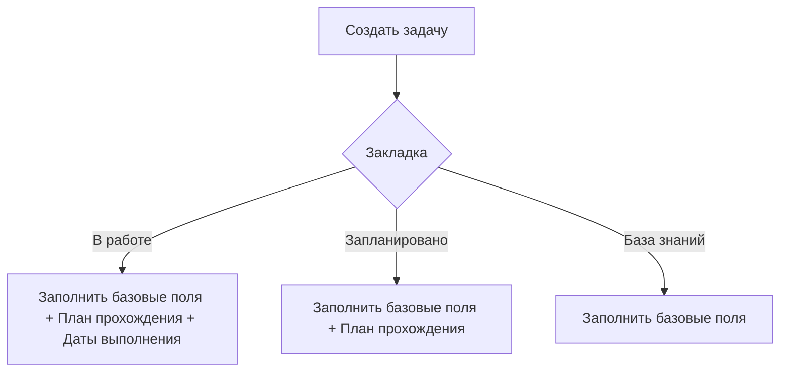

# Жизненный цикл задач

## Полный жизненный цикл задачи

## Детализация кнопок управления

### Кнопка "Создать задачу"

**Доступна в:** "В работе", "Запланировано", "База знаний".

#### Для раздела "База знаний":

| Поле      | Обязательное     | Тип             | Пример                                             | Описание                       |
| --------- | ---------------- | --------------- | -------------------------------------------------- | ------------------------------ |
| Тип       | Да               | Выбор из списка | Книга                                              | Книга/Статья/Курс/...          |
| Автор(-ы) | Только для Книги | Строка          | Одерски М., Спун Л., Веннерс Б., Соммерс Ф.        |                                |
| Название  | Да               | Строка          | Scala. Профессиональное программирование. 5-е изд. |                                |
| Раздел    | Да               | Выбор из списка | Scala                                              | Scala/ФП/Теория категорий/...  |
| Страниц   | Только для Книги | Число           | 608                                                |                                |
| Порядок   | Да               | Число           | 1                                                  | Порядок взятия задачи в работу |

#### Для раздела "Запланировано":

Дополнительно:

- План прохождения (текстовое поле с markdown-разметкой)
  Пример:
	- [ ] Глава 1
	- [ ] Глава 2
	- [ ] Глава 3
	- [ ] ...

#### Для раздела "В работе":

Дополнительно:

- Дата взятия в работу (авто-заполнение поля текущей датой)
- Планируемая дата выполнения

### 2. Кнопка "Поставить в очередь"

**Действие:** Переводит задачу из "База знаний" в "Запланировано"

### 3. Кнопка "Взять в работу"

**Действие:** Переводит задачу из "Запланировано" во "В работе"

### 4. Кнопка "Отложить"

**Доступна только в:** "В работе"

**Действие:** Возвращает задачу из "В работе" в "Запланировано"

### 5. Кнопка "Выполнить"

**Доступна только в:** "В работе"

**Поля для заполнения:**

1. Краткое ревью
2. Оценка (1-5 звёзд)
3. Дата выполнения (авто-заполнение)

### 5. Кнопка "Удаление"

**Важно:** Безвозвратное удаление!

**Процесс удаления:**

1. Показ модального окна с предупреждением
2. Требование подтверждения через ввод слова "УДАЛИТЬ"
3. Полное удаление всех связанных данных
