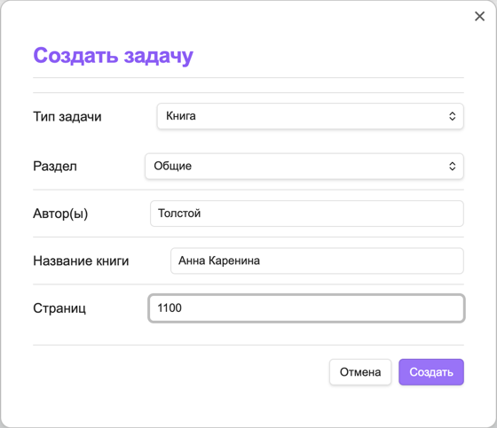
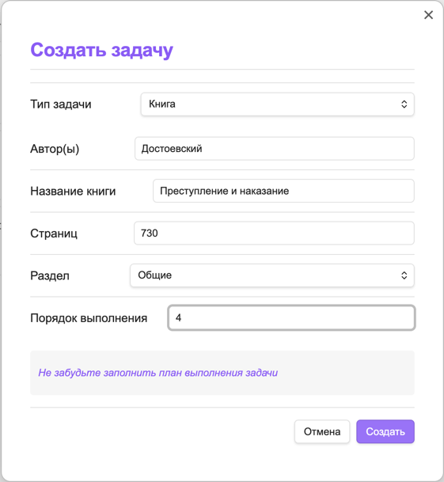
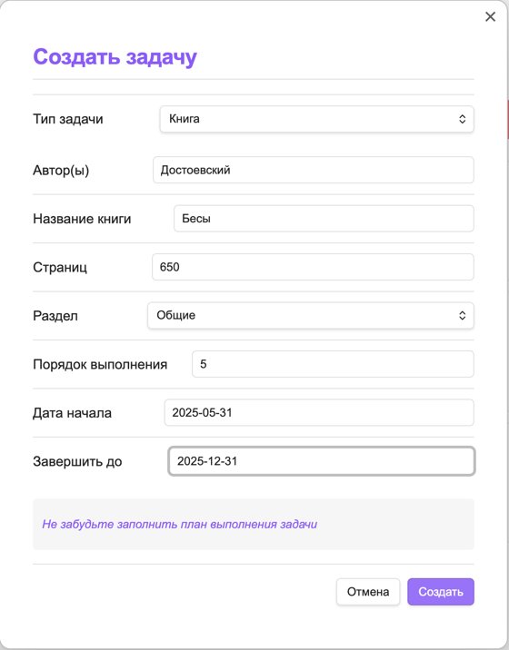

# Жизненный цикл задач

## Полный жизненный цикл задачи


Добавлено в Базу знаний -> Запланировано -> Взято в работу -> Выполнено и архивировано в Истории

## Детализация кнопок управления

### Кнопка "Создать задачу"

**Доступна на закладках:** "В работе", "Запланировано", "База знаний".

#### Для раздела "База знаний":

Форма создания задачи:



Для всех задач запрашиваются:

- Тип задачи - выбирается из типов, задаваемых в настройках
- Раздел - выбирается из разделов, задаваемых в настройках 

Для типа "Книга" дополнительно запрашиваются следующие поля:

- Автор - автор книги
- Название - название книги
- Страниц - количество страниц в книге
- Заголовок для книг формируется из полей "Автор - Название".

Для типа "Статья" запрашиваются следующие поля:

- Название - название статьи
- Ссылка на статью
- Трудозатратность в часах на статью

Создается такой файл:

```markdown
---
status: knowledge-base
type: Книга
section: Общие
authors: Толстой
name: Анна Каренина
title: Толстой - Анна Каренина
pages: 1100
order: 999
startDate: 
dueDate: 
---

# Информация

Описание задачи

## План выполнения

- [ ] Прочитать книгу
- [ ] Конспектировать

## Заметки

Добавьте ваши мысли
```

- Порядок заполняется значением по умолчанию - 999
- Даты пустые
- План выполнения берется из [настроек плагина](settings.md).

#### Для раздела "Запланировано":

Дополнительно к предыдущей форме "База знаний" запрашивается порядок 
и добавляется напоминание о необходимости заполнить план выполнения задачи.



- Даты пустые
- План выполнения берется из [настроек плагина](settings.md).

#### Для раздела "В работе":

Дополнительно к предыдущей форме "Запланировано" запрашиваются даты начала и планируемая дата выполнения.



- План выполнения берется из [настроек плагина](settings.md).

### 2. Кнопка "Поставить в очередь"

**Действие:** Переводит задачу из "База знаний" в "Запланировано"


### 3. Кнопка "Взять в работу"

**Действие:** Переводит задачу из "Запланировано" во "В работе"


### 4. Кнопка "Отложить"

**Доступна только в:** "В работе"

**Действие:** Возвращает задачу из "В работе" в "Запланировано"


### 5. Кнопка "Выполнить"

**Доступна только в:** "В работе"


**Поля для заполнения:**

1. Краткое ревью
2. Оценка (1-5 звёзд)
3. Дата выполнения (авто-заполнение)

### 5. Кнопка "Удаление"

**Важно:** Безвозвратное удаление!

**Процесс удаления:**

1. Показ модального окна с предупреждением
2. Требование подтверждения через ввод слова "УДАЛИТЬ"
3. Полное удаление всех связанных данных


## Типы задач

## Общие поля для всех типов задач

- **Тип** - Категория контента (книга, статья, видео, подкаст и т.д.)
- **Название** - Основное название материала
- **Статус** - Статус выполнения (В работе/Запланировано/База знаний)
- **Раздел** - Тематическая категория (например: Программирование, Теория Категорий)
- **Порядок** - Приоритет в очереди (цифра, где 1 - высший приоритет)
- **Дата взятия в работу** - Дата начала работы с материалом (формат: ГГГГ-ММ-ДД)
- **Дата выполнения** - Планируемая дата завершения (формат: ГГГГ-ММ-ДД)

### Книга

#### Дополнительные поля

- **Автор(-ы)** - ФИО автора или список авторов
- **Название** - Название книги
- **Страниц** - Общее количество страниц

#### Тело задачи

```markdown
---
status: in-progress
type: Книга
section: Общие
authors: Достоевский
name: Бесы
title: Достоевский - Бесы
pages: 650
order: 5
startDate: 2025-05-31
dueDate: 2025-12-31
---

# Информация

Описание задачи

## План выполнения

- [ ] Прочитать книгу
- [ ] Конспектировать

## Заметки

Добавьте ваши мысли
```

### Статья

#### Дополнительные поля

- **Источник**: Ссылка на публикацию
- **Трудозатратность**: в часах

#### Тело задачи

```markdown
---
status: knowledge-base
type: Статья
section: Обучение
title: Тренды UX и UI на 2025 год
link: https://practicum.yandex.ru/blog/glavnye-trendy-ux-ui
laborInputInHours: 2.5
order: 6
startDate: 2025-05-05
dueDate: 2025-09-15
---

# Информация

Описание задачи

## План выполнения

- [ ] Прочитать
- [ ] Выписать цитаты

## Заметки

Добавьте ваши мысли
```

### Видео

#### Дополнительные поля

- **Автор/Канал**: Создатель контента
- **Платформа**: YouTube/Coursera и т.д.
- **Ссылка**: URL видео
- **Продолжительность**: Длительность в минутах

#### Тело задачи

```markdown
---
status: planned
type: Видео
section: Общие
title: Пример видео
author: Автор видео
platform: vimeo
link: vimeo.ru
durationInMinutes: 45
order: 5
startDate: 
dueDate: 
---

# Информация

Описание задачи

## План выполнения

- [ ] Посмотреть
- [ ] Конспектировать

## Заметки

Добавьте ваши мысли
```

### Подкаст

#### Дополнительные поля

- **Автор/Подкаст**: Название шоу или автора
- **Платформа**: Spotify, Apple Podcasts и т.д.
- **Продолжительность**: Длительность в минутах

#### Тело задачи

```markdown
---
status: in-progress
type: Подкаст
section: Общие
title: Culips
author: James
platform: spotify
link: spotidy.ru
durationInMinutes: 43
order: 4
startDate: 2025-06-06
dueDate: 2025-06-30
---

# Информация

Описание задачи

## План выполнения

- [ ] Прослушать
- [ ] Конспектировать

## Заметки

Добавьте ваши мысли
```

### Курс

#### Дополнительные поля

- **Платформа**: Coursera/Stepik и т.д.
- **Продолжительность**: Длительность в минутах

#### Тело задачи

```markdown
---
status: in-progress
type: Курс
section: Общие
title: Scala для начинающих
platform: Cuorsera
link: courcera.ru
durationInMinutes: 145
order: 5
startDate: 2025-04-05
dueDate: 2025-07-31
---

# Информация

Описание задачи

## План выполнения

- [ ] Пройти урок
- [ ] Выполнить задания

## Заметки

Добавьте ваши мысли
```

### Произвольный тип (UserType)

#### Дополнительные поля

- **Трудозатратность**: в часах

#### Тело задачи

```markdown
---
status: in-progress
type: OpenSearch
section: Общие
title: пппп
laborInputInHours: 5
order: 999
startDate: 2025-10-10
dueDate: 2025-10-10
---

# Информация

Описание задачи

## План выполнения

- [ ] Изучить OpenSearch проект

## Заметки

Добавьте ваши мысли
```
