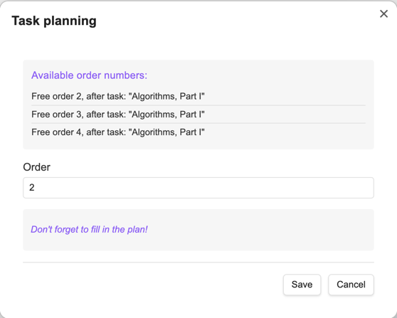

# 📌 Lifecycle of tasks in the plugin

## 🔄 Full cycle of task execution

```
Knowledge Base --> Planned --> In Progress --> Completed ("History")
```

1. **Knowledge Base** - Source repository of materials
2. **Planned** - Tasks added to the execution queue
3. **In Progress** - Actively executed tasks
4. **History** - Completed tasks

---

## Task management buttons

### "Create task" button

All sections ("Knowledge Base", "Planned", "In Progress")


#### Common fields:

| Field     | Description                  |
|-----------|------------------------------|
| Task type | Choose from configured types |
| Section   | Subject category             |

#### Additional fields by type:

| Task type  | Additional fields                          |
|------------|--------------------------------------------|
| 📚 Book    | Author, Title, Pages                       |
| 📄 Article | Link, Effort (hours)                       |
| ▶ Video    | Author, Platform, Link, Duration (minutes) |
| 🎧 Podcast | Author, Platform, Link, Duration (minutes) |
| 🎓 Course  | Platform, Link, Duration (minutes)         |
| ✏️ Custom  | Effort (hours)                             |

#### Example of a task file (Book):

````markdown
---
status: in-progress
type: Book
section: Literature
authors: Tolstoy L.N.
name: War and Peace
title: Tolstoy L.N. - War and Peace
pages: 1274
order: 3
startDate: 2025-05-31
dueDate: 2025-12-31
---

## Execution plan

- [ ] Read volume 1
- [ ] Read volume 2
- [ ] Read volume 3
- [ ] Read volume 4
````

---

### "Add to queue" button (from "Knowledge Base" only)



1. Filling in the execution order: the first free task orders of the same type as those being added to the queue are displayed.
2. Reminder about the need to add an execution plan.

---

### "Take into work" button (only from "Planned")

**Filled-in fields:**

- Start date (automatically inserts the current date)
- The date of taking the task into work cannot be earlier than the current date
- Planned completion date
- The planned completion date cannot be earlier than the start date


---

### "Complete" button (only from "In work")

**Filled-in fields:**

1. Brief task review
2. Estimate (⭐️1-5)
3. Actual completion date


**Result:** Transferring the task to [History](history.md)

---

### "Postpone" button (only from "In work")

Return to "Planned" with cleared start and end dates

---

### "Delete task" button

**Irreversibly deletes the task!**

---

## 📂 Task types and their structure

### Common fields for all types

- **Status** (`status`): current task status:
    - "In-progress" (`in-progress`),
    - "Planned" (`planned`),
    - "Knowledge base" (`knowledge-base`)
- **Type** (`type`): task type: Book, Podcast, Course, etc.
- **Section** (`section`): task section
- **Title** (`title`): task name
- **Priority** (`order`): order of execution
- **StartDate** (`startDate`): task start date
- **DueDate** (`dueDate`): planned completion date

### Additional fields

#### Book

- **Author(s)** (`authors`): author's full name or list of authors
- **Title** (`name`): book name
- **Pages** (`pages`): total number of pages

> Task name for books is filled with the value "Author - Title"

#### Article

- **Source** (`link`): publication link
- **Duration** (`durationInMinutes`): duration in minutes

#### Video

- **Author/Channel** (`author`): Content creator
- **Platform** (`platform`): YouTube/Coursera etc.
- **Link** (`link`): Video URL
- **Duration** (`durationInMinutes`): Duration in minutes

#### Podcast

- **Platform** (`platform`): YouTube/Coursera etc.
- **Link** (`link`): link to the podcast
- **Episodes** (`episodes`): number of episodes in the podcast
- **Duration of one episode** (`durationInMinutes`): duration in minutes

#### Course

- **Platform** (`platform`): course platform
- **Link** (`link`): link to the course
- **Duration** (`durationInMinutes`): duration in minutes

#### Custom type

- **Labor Input** (`laborInputInHours`): in hours

---

## 💡 Recommendations for work

1. For complex tasks, use detailed execution plans
2. Regularly check the "Planned" section to update priorities
3. Use the history of completed tasks to analyze productivity
