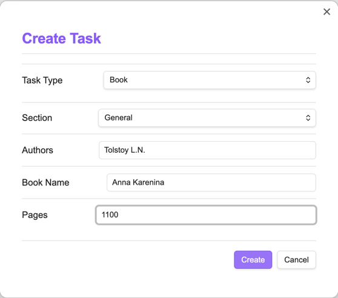

# Жизненный цикл задач

## Полный жизненный цикл задачи


## Детализация кнопок управления

### Кнопка "Создать задачу"

**Доступна на закладках:** "В работе", "Запланировано", "База знаний".

#### Для раздела "База знаний":

Форма создания задачи:



Для всех задач запрашиваются:

- Тип задачи - выбирается из типов, задаваемых в настройках
- Раздел - выбирается из разделов, задаваемых в настройках 

Для типа "Книга" запрашиваются следующие поля:

- Автор - автор книги
- Название - название книги
- Страниц - количество страниц в книге

Создается такой файл:

```markdown
---
status: knowledge-base
type: Книга
section: Общие
authors: Толстой
name: Анна Каренина
title: Толстой - Анна Каренина
pages: 1100
order: 999
startDate: 
dueDate: 
---

# Информация

Описание задачи

## План выполнения

- [ ] Прочитать книгу
- [ ] Конспектировать

## Заметки

Добавьте ваши мысли
```

- Заголовок формируется из полей "Автор - Название".
- Порядок заполняется значением по умолчанию - 999
- Даты пустые
- План выполнения берется из [настроек плагина](settings.md).

#### Для раздела "Запланировано":

Дополнительно к предыдущей форме "База знаний" запрашивается порядок 
и добавляется напоминание о необходимости заполнить план выполнения задачи.


Создается такой файл:

```markdown
---
status: planned
type: Книга
section: Общие
authors: Достоевский
name: Преступление и наказание
title: Достоевский - Преступление и наказание
pages: 730
order: 4
startDate: 
dueDate: 
---

# Информация

Описание задачи

## План выполнения

- [ ] Прочитать книгу
- [ ] Конспектировать

## Заметки

Добавьте ваши мысли
```

- Даты пустые
- План выполнения берется из [настроек плагина](settings.md).

#### Для раздела "В работе":

Дополнительно к предыдущей форме "Запланировано" запрашиваются даты начала и планируемая дата выполнения.


Создается такой файл:

```markdown
---
status: in-progress
type: Книга
section: Общие
authors: Достоевский
name: Бесы
title: Достоевский - Бесы
pages: 650
order: 5
startDate: 2025-05-31
dueDate: 2025-12-31
---

# Информация

Описание задачи

## План выполнения

- [ ] Прочитать книгу
- [ ] Конспектировать

## Заметки

Добавьте ваши мысли
```

- План выполнения берется из [настроек плагина](settings.md).

### 2. Кнопка "Поставить в очередь"

**Действие:** Переводит задачу из "База знаний" в "Запланировано"


### 3. Кнопка "Взять в работу"

**Действие:** Переводит задачу из "Запланировано" во "В работе"


### 4. Кнопка "Отложить"

**Доступна только в:** "В работе"

**Действие:** Возвращает задачу из "В работе" в "Запланировано"


### 5. Кнопка "Выполнить"

**Доступна только в:** "В работе"


**Поля для заполнения:**

1. Краткое ревью
2. Оценка (1-5 звёзд)
3. Дата выполнения (авто-заполнение)

### 5. Кнопка "Удаление"

**Важно:** Безвозвратное удаление!

**Процесс удаления:**

1. Показ модального окна с предупреждением
2. Требование подтверждения через ввод слова "УДАЛИТЬ"
3. Полное удаление всех связанных данных


# Типы задач

## Общие поля для всех типов задач

- **Тип** - Категория контента (книга, статья, видео, подкаст и т.д.)
- **Название** - Основное название материала
- **Статус** - Статус выполнения (В работе/Запланировано/База знаний)
- **Раздел** - Тематическая категория (например: Программирование, Теория Категорий)
- **Порядок** - Приоритет в очереди (цифра, где 1 - высший приоритет)
- **Дата взятия в работу** - Дата начала работы с материалом (формат: ГГГГ-ММ-ДД)
- **Дата выполнения** - Планируемая дата завершения (формат: ГГГГ-ММ-ДД)

### Прогресс

Прогресс считается по проценту выполненных пунктов в задаче

## Книга

### Дополнительные поля

- **Автор(-ы)** - ФИО автора или список авторов
- **Название** - Название книги
- **Страниц** - Общее количество страниц

### Тело задачи

```markdown
## Описание

Краткое описание содержания и цели чтения

## Прогресс выполнения

- [x] Прочитать главы 1-3 (2023-10-01)
- [ ] Прочитать главы 4-6
- [ ] Сделать конспект
- [ ] Сохранить книгу в Облаке (дополнительный пункт для всех задач типа Книга, задаваемый в настройках)
- [ ] Посоветовать друзьям (дополнительный пункт для всех задач типа Книга, задаваемый в настройках)
```

## Статья

### Дополнительные поля

- **Источник**: Ссылка на публикацию
- **Трудозатратность**: в часах

### Тело задачи

```markdown
## Аннотация

[Краткое содержание]

## Прогресс выполнения

- [x] Первичное прочтение (2023-10-01)
- [ ] Выделить ключевые тезисы
- [ ] Добавить в базу знаний (дополнительный пункт для всех задач типа Статья, задаваемый в настройках)
```

## Видео

### Дополнительные поля

- **Автор/Канал**: Создатель контента
- **Платформа**: YouTube/Coursera и т.д.
- **Ссылка**: URL видео
- **Продолжительность**: Длительность в минутах

### Тело задачи

```markdown
## Описание

[О чем видео, зачем смотреть]

## Конспект

- Таймкоды ключевых моментов
- Основные идеи

## Прогресс выполнения

- [x] Первый просмотр (2023-10-01)
- [ ] Анализ контента
- [ ] Выписать цитаты
- [ ] Добавить в базу знаний (дополнительный пункт для всех задач типа Видео, задаваемый в настройках)
```

## Подкаст

### Дополнительные поля

- **Автор/Подкаст**: Название шоу или автора
- **Платформа**: Spotify, Apple Podcasts и т.д.
- **Продолжительность**: Длительность в минутах

### Тело задачи

```markdown
## Основные темы

[О чем этот подкаст]

## Полезная информация

- Ключевые моменты
- Ссылки на упомянутые ресурсы

## Прогресс выполнения

- [x] Прослушан первый час (2023-10-01)
- [ ] Конспектирование
- [ ] Добавить заметки в базу знаний (дополнительный пункт для всех задач типа Подкаст, задаваемый в настройках)
```

## Курс

### Дополнительные поля

- **Платформа**: Coursera/Stepik и т.д.
- **Продолжительность**: Длительность в минутах

### Тело задачи

```markdown
## Описание курса

[Чему посвящен курс, цели изучения]

## Программа

- Список модулей с прогрессом
- Важные задания

## Прогресс выполнения

- [x] Завершен модуль 1 (2023-10-01)
- [ ] Выполнить практическое задание 2
- [ ] Пройти тест по модулю 3
- [ ] Добавить заметки в базу знаний (дополнительный пункт для всех задач типа Курс, задаваемый в настройках)
```

## Произвольный тип (UserType)

### Дополнительные поля

- **Трудозатратность**: в часах

### Тело задачи

```markdown
## Детали

[Полное описание задачи]

## Требования

- Необходимые подготовительные действия
- Дополнительные материалы

## Прогресс выполнения

- [x] Этап 1 (2023-10-01)
- [ ] Этап 2
- [ ] Финальная проверка
- [ ] Дополнительные задачи из настроек (дополнительный пункт для всех задач типа UserType, задаваемый в настройках)
```
