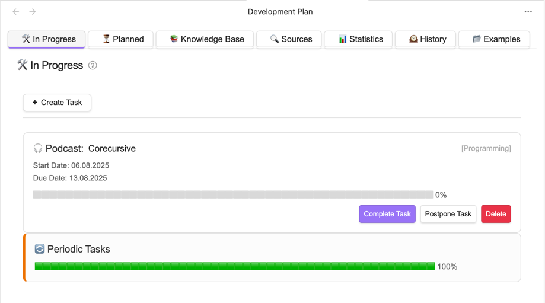
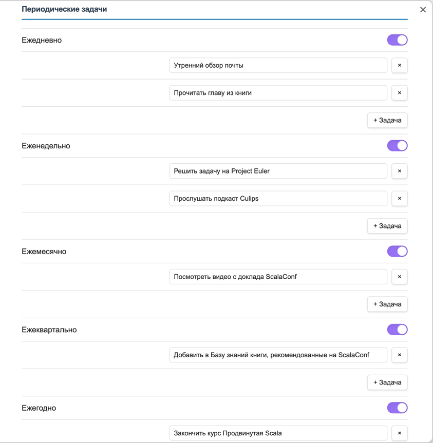

# Система периодических задач

## Механизм работы

На закладке "В работе" после задач, взятых в работу, выводится карточка для периодических задач.



Карточка предназначена для работы с задачами, добавляемыми по расписанию.

**Структура карточки**:

```markdown
## Разовые задачи

- [ ] Подготовить презентацию к митингу
	
## Ежедневные задачи

- [ ] Утренний обзор почты
- [ ] Прочитать главу из книги

## Еженедельные задачи

- [ ] Решить задачу на Project Euler
- [ ] Прослушать подкаст Culips

## Ежемесячные задачи

- [ ] Посмотреть видео с доклада ScalaConf

## Ежеквартальные задачи

- [ ] Добавить в Базу знаний книги, рекомендованные на ScalaConf

## Ежегодные задачи

- [ ] Закончить курс Продвинутая Scala
```

Разовые задачи - добавляются, завершаются и удаляются пользователем самостоятельно. 
Они предназначены для текущих задач пользователя. Например, "Написать статью о кортежах в Scala".

При клике на карточку задачи происходит пересчет периодических задач.
Создаются задачи за все периоды, начиная с даты начала расчета статистики по сегодняшний день включительно.

Под полем Ежедневные задачи создаются задачи за каждый день (если включена настройка ежедневных задач `settings.periodicTasks.daily.enabled`), 
подзадачи берутся из настроек (`settings.periodicTasks.daily.tasks` - массив строк):

Пример:

```markdown
## Ежедневные задачи

#### 2025-01-01

- [ ] Утренний обзор почты
- [ ] Прочитать главу из книги

#### 2025-01-02

- [ ] Утренний обзор почты
- [ ] Прочитать главу из книги
```

После создания задачи определенного типа, эта задача добавляется в созданные задачи:

```completed_tasks.json
{
  "daily": [ "2025-01-01", "2025-01-02" ],
  "weekly": [ "2025-W01", "2025-W50" ]
  "monthly": [ "2025-01", "2024-12" ]
  "quarterly": [ "2025-Q1", "2024-Q4" ]
  "yearly": [ "2025", "2024" ]
}
```

При этом задача за определенный день не создается по следующим причинам: 

- если отключена настройка ежедневных задач `settings.periodicTasks.daily.enabled`
- если задача создавалась ранее и есть в `completed_tasks.json`

Аналогично для остальных типов задач:

- Еженедельные
- Ежемесячные
- Ежеквартальные
- Ежегодные

## Типы периодичностей

- Ежедневные
- Еженедельные
- Ежемесячные
- Ежеквартальные
- Ежегодные

Задаются в настройках:


