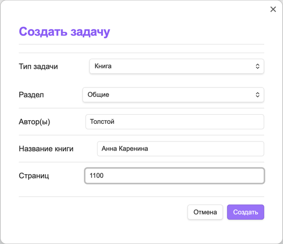
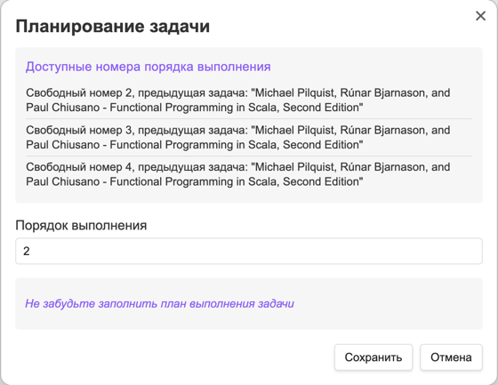
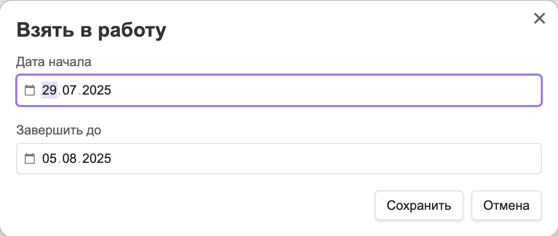

# 📌 Жизненный цикл задач

## 🔄 Полный цикл выполнения задачи

```
База знаний --> Запланировано --> В работе --> Выполнено ("История")
```

1. **База знаний** - Исходное хранилище материалов
2. **Запланировано** - Задачи, добавленные в очередь выполнения
3. **В работе** - Активно выполняемые задачи
4. **История** - Завершенные задачи

---

## Кнопки управления задачами

### Кнопка "Создать задачу"

Все разделы ("База знаний", "Запланировано", "В работе")



#### Общие поля:

| Поле       | Описание                   |
|------------|----------------------------|
| Тип задачи | Выбор из настроенных типов |
| Раздел     | Тематическая категория     |

#### Дополнительные поля по типам:

| Тип задачи          | Дополнительные поля                             |
|---------------------|-------------------------------------------------|
| 📚 Книга            | Автор, Название, Страницы                       |
| 📄 Статья           | Ссылка, Трудоемкость (часы)                     |
| ▶ Видео             | Автор, Платформа, Ссылка, Длительность (минуты) |
| 🎧 Подкаст          | Автор, Платформа, Ссылка, Длительность (минуты) |
| 🎓 Курс             | Платформа, Ссылка, Длительность (минуты)        |
| ✏️ Пользовательский | Трудоемкость (часы)                             |

#### Пример файла задачи (Книга):

````markdown
---
status: in-progress
type: Книга
section: Литература
authors: Толстой Л.Н.
name: Война и мир
title: Толстой Л.Н. - Война и мир
pages: 1274
order: 3
startDate: 2025-05-31
dueDate: 2025-12-31
---

## План выполнения

- [ ] Прочитать том 1
- [ ] Прочитать том 2
- [ ] Прочитать том 3
- [ ] Прочитать том 4
````

---

### Кнопка "Поставить в очередь" (только из "Базы знаний")



1. Заполнение порядка выполнения: выводятся первые свободные порядки задач того же типа, что и ставится в очередь.
2. Напоминание о необходимости добавления плана выполнения.

---

### Кнопка "Взять в работу" (только из "Запланировано")

**Заполняемые поля:**

- Дата начала (автоподстановка текущей даты)
    - Дата взятия задачи в работу не может быть раньше текущей даты
- Планируемая дата завершения
    - Планируемая дата завершения не может быть раньше даты начала



---

### Кнопка "Выполнить" (только из "В работы")

**Заполняемые поля:**

1. Краткое ревью задачи
2. Оценка (⭐️1-5)
3. Фактическая дата завершения


**Результат:** Перенос задачи в [Историю](history.md)

---

### Кнопка "Отложить" (только из "В работе")

Возврат в "Запланировано" с очисткой дат начала и окончания

---

### Кнопка "Удаление задачи"

**Безвозвратное удаление задачи!**  

---

## 📂 Типы задач и их структура

### Общие поля для всех типов

- **Статус** (`status`): текущий статус задачи: 
    - "В работе" (`in-progress`), 
    - "Запланировано" (`planned`), 
    - "База знаний" (`knowledge-base`)
- **Тип** (`type`): тип задачи: Книга, Подкаст, Курс и т.д.
- **Раздел** (`section`): раздел задачи
- **Название** (`title`): название задачи
- **Приоритет** (`order`): порядок выполнения
- **Дата начала** (`startDate`): дата начала работы над задачей
- **Дата окончания** (`dueDate`): планируемая дата выполнения

### Дополнительные поля

#### Книга

- **Автор(-ы)** (`authors`): ФИО автора или список авторов
- **Наименование** (`name`): Наименование книги
- **Страниц** (`pages`): Общее количество страниц

> Название задачи для книг заполняется значением "Автор - Наименование"

#### Статья

- **Источник** (`link`): Ссылка на публикацию
- **Продолжительность** (`durationInMinutes`): Длительность в минутах

#### Видео

- **Автор/Канал** (`author`): Создатель контента
- **Платформа** (`platform`): YouTube/Coursera и т.д.
- **Ссылка** (`link`): URL видео
- **Продолжительность** (`durationInMinutes`): Длительность в минутах

#### Подкаст

- **Платформа** (`platform`): YouTube/Coursera и т.д.
- **Ссылка** (`link`): ссылка на подкаст
- **Эпизодов** (`episodes`): количество эпизодов в подкасте
- **Продолжительность одного эпизода** (`durationInMinutes`): Длительность в минутах

#### Курс

- **Платформа** (`platform`): Платформа курса
- **Ссылка** (`link`): ссылка на курс
- **Продолжительность** (`durationInMinutes`): Длительность в минутах

#### Пользовательский тип

- **Трудозатратность** (`laborInputInHours`): в часах

---

## 💡 Рекомендации по работе

1. Для сложных задач используйте детализированные планы выполнения
2. Регулярно проверяйте раздел "Запланировано" для актуализации приоритетов
3. Используйте историю выполненных задач для анализа продуктивности
