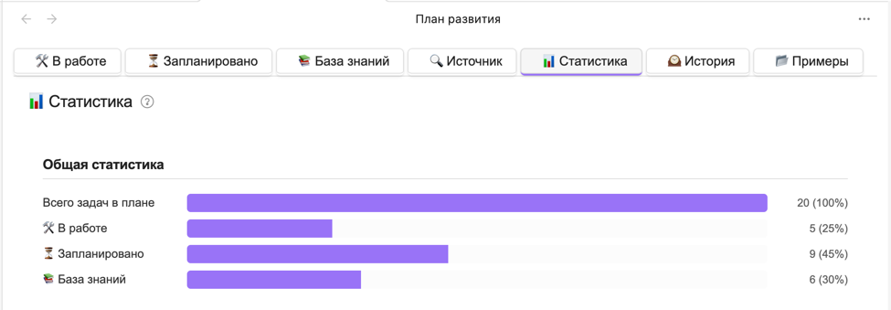
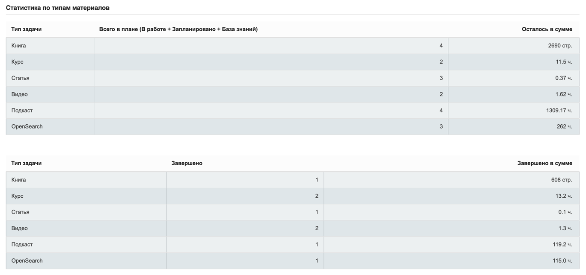
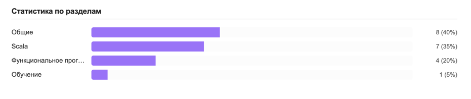
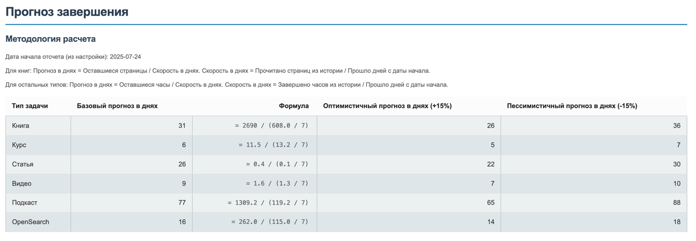

# Система статистики и прогнозирования

## 📊 Общая статистика

### Основные метрики продуктивности

**Всего задач в системе**  

Совокупный объем учебных материалов во всех статусах:

- `В работе` - активные задачи с прогрессом выполнения
- `Запланировано` - материалы в очереди на изучение  
- `База знаний` - материалы без детализации выполнения

*Пример:*  



### 📚 По типам контента

Для каждого типа материалов рассчитывается:

1. **Общее количество**  
   Сумма материалов этого типа во всех разделах (В работе + Запланировано + База знаний)

2. **Остаток работы**
	- Для книг: количество непрочитанных страниц
	- Для остальных типов: оставшееся время в часах

3. **Завершенные**  
   Количество выполненных материалов из истории



### По разделам

Количество задач по разделам.



## Система прогнозирования

### Методология расчета

**Базовые параметры:**

- Дата начала отсчета из настроек плагина: [YYYY-MM-DD]

**Алгоритмы прогноза:**

Для **книг**:

> Прогноз в днях = Общее кол-во оставшихся страниц / Средняя скорость (прочитано страниц/пройдено дней с начала отсчета)

Для остальных типов:

> Прогноз в днях = Суммарная оставшаяся продолжительность / Средняя скорость (завершено в часах/пройдено дней с начала отсчета)

### Пример прогноза



## 💡 Советы по использованию

1. Для точного прогноза:
	- Регулярно обновляйте статусы задач

2. При анализе:
	- Сравнивайте прогноз с фактическими результатами
	- Учитывайте сезонные факторы (отпуск, праздники)

3. Для балансировки нагрузки:
	- Анализируйте распределение по типам контента
	- Оптимальное распределение:
	  ```text
	  ⚖️ Идеальное соотношение:
	  ├─ 50% - Основная специализация
	  ├─ 30% - Смежные направления
	  └─ 20% - Новые области
	  ```

4. **Анализ эффективности по типам контента**
	- Сравнивайте скорость освоения:
	  ```text
	  Книги: 12 стр/день  
	  Курсы: 0.8 ч/день
	  Видео: 1.2 ч/день
	  ```

### 🚀 Как улучшить продуктивность

**Методика 1: Принцип 80/20**

- Проанализируйте 20% материалов, дающих 80% результата

**Методика 2: Корректировка плана**

При перегруженности (больше 5 задач "В работе"):

```text
Действия:
1. Переведите 2 задачи в "Запланировано"
2. Установите четкие дедлайны
3. Добавьте промежуточные вехи
```

Для сложных материалов:

```text
Стратегия изучения:
├─ Разбейте на части (по 30-60 мин)
├─ Чередуйте с легкими задачами
└─ Фиксируйте прогресс ежедневно
```

**Методика 3: Оптимизация времени**

Используйте данные о среднем времени выполнения:

```text
Статьи:
├─ Фактическое: 1.2 ч
├─ Планируемое: 0.8 ч
└─ Корректировка: +30% к оценкам
```

### ⚠️ На что обратить особое внимание

**Красные флаги**

- Задачи "В работе" >7 дней без прогресса
- Несоответствие прогноза и фактических сроков ±40%
- Более 70% материалов в одном разделе
