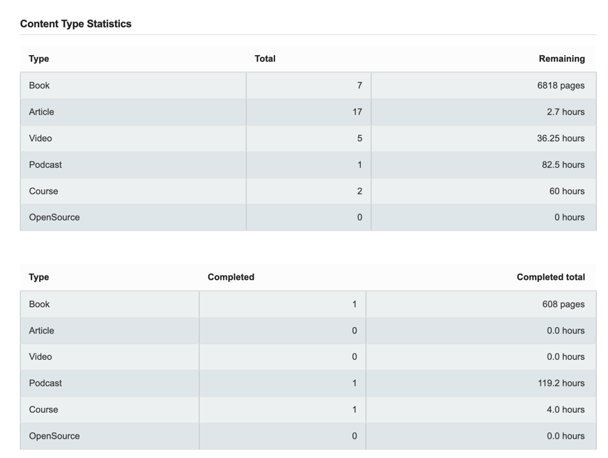

# Statistics and forecasting system

## 📊 General statistics

### Key productivity metrics

**Total tasks in the system**

Total volume of educational materials in all statuses:

- `In progress` - active tasks with progress
- `Planned` - materials in the study queue
- `Knowledge base` - materials without completion details

*Example:*


### 📚 By content types

For each type of materials, the following is calculated:

1. **Total quantity**
   The sum of materials of this type in all sections (In progress + Planned + Knowledge base)

2. **Remaining work**
   - For books: the number of unread pages
   - For other types: the remaining time in hours

3. **Completed**
   The number of completed materials from history



### By sections

Number of tasks by sections.


## Forecasting system

### Calculation methodology

**Basic parameters:**

- Start date from plugin settings: [YYYY-MM-DD]

**Forecast algorithms:**

For **books**:

> Forecast in days = Total number of pages remaining / Average speed (pages read / days passed since start)

For other types:

> Forecast in days = Total remaining duration / Average speed (completed in hours / days passed since start)

### Forecast example


## 💡 Usage tips

1. For an accurate forecast:
   - Update task statuses regularly

2. When analysis:
   - Compare forecast with actual results
   - Consider seasonal factors (vacation, holidays)

3. To balance the load:
   - Analyze the distribution by content types
   - Optimal distribution:
   ```text
   ⚖️ Ideal ratio:
   ├─ 50% - Main specialization
   ├─ 30% - Related areas
   └─ 20% - New areas
   ```

4. **Analysis of efficiency by content types**
   - Compare the speed of mastering:
   ```text
   Books: 12 pages/day
   Courses: 0.8 hours/day
   Videos: 1.2 hours/day
   ```

### 🚀 How to improve productivity

**Method 1: The 80/20 Principle**

- Analyze 20% of materials that give 80% results

**Method 2: Adjusting the plan**

When overloaded (more than 5 tasks "In progress"):

```text
Actions:
1. Move 2 tasks to "Planned"
2. Set clear deadlines
3. Add intermediate milestones
```

For complex materials:

```text
Study strategy:
├─ Break into parts (30-60 min)
├─ Alternate with easy tasks
└─ Record progress daily
```

**Method 3: Optimizing time**

Use data on average execution time:

```text
Articles:
├─ Actual: 1.2 h
├─ Planned: 0.8 h
└─ Adjustment: +30% to ratings
```

### ⚠️ What to pay special attention to

**Red flags**

- Tasks "In progress" >7 days without progress
- Discrepancy between forecast and actual deadlines ±40%
- More than 70% of materials in one section
